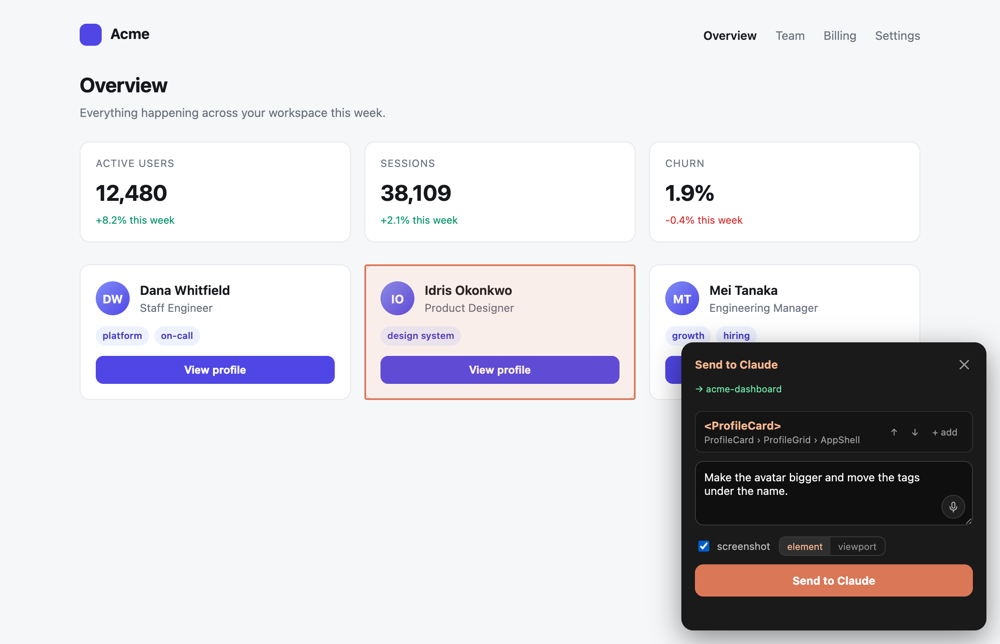
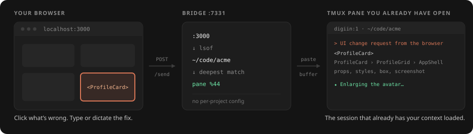

# claude-tmux-bridge

**Point at what's wrong in your browser. Fix it in the Claude Code session you already
have open in tmux.**

Click an element, say what should change, and it lands in the prompt of the right Claude
pane — with the React component name and ancestry, serialized props, a clean selector,
computed styles, recent console errors, and an optional screenshot. Nothing here drives
your browser; context flows one way, from your eyes to the agent.



## How it works



The widget sends the page URL. The bridge reads the dev-server **port**, finds the
process listening on it (`lsof`), takes its **working directory**, and matches the Claude
pane whose cwd is inside that project. Open as many projects as you like at once — no
pinning, no per-project config.

Cascade: pinned pane (if it still exists) → port→cwd→pane → configured project → the only
Claude pane. It never hard-fails on a stale pane id.

## Requirements

tmux, Node 20+, `lsof`, and Claude Code running in a tmux pane. Only `service` is
macOS-only. Dictation additionally wants `whisper-cpp` + a ggml model.

## Install

```bash
npm i -g github:aristeoibarra/claude-tmux-bridge     # public repo, no token
claude-tmux-bridge start                             # or: service install
```

Also on GitHub Packages as `@aristeoibarra/claude-tmux-bridge`, which needs a `~/.npmrc`
with a `read:packages` token. To hack on it: clone, `npm install && npm link`.

```bash
claude-tmux-bridge service install     # launchd: starts at login, restarts if it dies
```

## Load the widget

**Extension (recommended):** open `brave://extensions`, enable Developer mode, **Load
unpacked** → the `extension/` folder. It now appears on every `localhost` app
automatically.

**Bookmarklet:** open `http://localhost:7331` and drag the button to your bookmarks bar.

**CSP-strict projects:** copy [`examples/ClaudeBridge.tsx`](examples/ClaudeBridge.tsx)
into the repo and render it in the root layout, dev-only.

### Settings

In the extension's toolbar popup. The on-page widget is the composer and nothing else.
Changes apply live to open tabs, no reload.

| Setting | Scope |
| --- | --- |
| **Target session** — pin a pane instead of auto-routing | per origin |
| **auto-send** — off pastes for review first | global |
| **Dictation language** | global |
| **Selection shortcut** — defaults to `Alt+C` | global |

Loaded via bookmarklet or project mount there is no popup, so the widget runs on defaults.

## Daily use

`Alt+C` or the button → hover → click. Refine with **↑ parent / ↓ child**, or **+ add**
for several elements. Type the change (or dictate it with the mic), tick **screenshot** if
it's visual, send. The panel shows **→ <project>** before you send, and after an auto-send
the status line mirrors what Claude is doing, read from the tmux pane title.

## What lands in the pane

```text
[claude-tmux-bridge] UI change request from the browser

Request: Make the avatar bigger and move the tags under the name.
Page: http://localhost:4173/
Screenshot: /tmp/claude-tmux-bridge/shot-1754112000-a1b2c3.png

Element 1: <ProfileCard>
- Component path: ProfileCard › ProfileGrid › AppShell
- Selector: article:nth-of-type(2)
- Props: name="Idris Okonkwo", role="Product Designer", initials="IO", tags=Array(1)
- Box: 320×160 at (430, 312)
- Key styles: display: flex; width: 320px; padding: 18px; gap: 12px;
  flexDirection: column; fontSize: 15px; color: rgb(22, 24, 29); …
- Text: "IOIdris OkonkwoProduct Designerdesign systemView profile"
- HTML:
<article class="card"><div class="row"><div class="avatar">IO</div><div class="who">…
```

Props are serialized (scalars verbatim, objects summarized) so the agent sees the data,
not just the markup. Recent console errors, uncaught exceptions and failed fetches ride
along too, buffered from page load.

Component identity is the point: React 19 dropped `_debugSource`, so there is no
`file:line` to hand over — the ancestry is what lets the agent grep straight to the file.
For deterministic locations, mount
[`examples/babel-plugin-data-source.cjs`](examples/babel-plugin-data-source.cjs) dev-only;
it stamps host elements with `data-source="src/Card.tsx:3"` and the widget picks it up.
On Next 16.2+ Turbopack loads it as an external transform at no measurable cost.

## Dictation (local, no cloud)

Click the mic inside the textarea, talk, click again (or press **Esc**) to transcribe —
the text appends to your draft. The browser records; the bridge transcribes with
[whisper.cpp](https://github.com/ggml-org/whisper.cpp) on your machine. No audio leaves
the box. That's deliberate: the Web Speech API is Google's hosted recognizer, and Brave
disables it outright.

```bash
brew install whisper-cpp
curl -L -o ~/.local/share/whisper-cpp/ggml-small.bin \
  https://huggingface.co/ggerganov/whisper.cpp/resolve/main/ggml-small.bin
```

Model lookup is automatic across the usual share dirs; it prefers `small` (~2s on Apple
Silicon) and skips English-only `.en` builds. Override `whisperBin`/`whisperModel` in
`~/.config/claude-tmux-bridge/config.json`. If whisper is missing the mic hides itself and
the popup says why.

**If your app sends `Permissions-Policy: microphone=()`** the mic is dead — that's an
empty allowlist, so not even the page itself may record and `getUserMedia` throws
`NotAllowedError` regardless of the site permission. Use `microphone=(self)` in dev. Your
CSP also needs `connect-src` to reach `http://localhost:7331`.

## Commands

| Command | What it does |
| --- | --- |
| `start [--port N] [--project PATH]` | Start the bridge (default `:7331`) |
| `service <install\|uninstall\|status>` | Run as a launchd service (macOS) |
| `target [%id\|--clear]` | Pin/clear a target pane (rarely needed) |
| `panes` | List tmux panes and guess which run Claude Code |

## Security

Development-only. The bridge binds to `localhost`, accepts any local origin, and pastes
what it receives into your pane. Run it only on a machine you control; don't expose the
port.

## License

MIT
